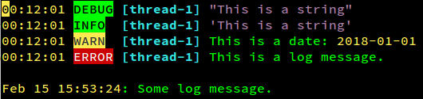

## Description

Generic log syntax highlighting for Vim. A set of simple syntax highlighting
rules that should work well for a wide variety of log formats.

This syntax file will highlight:
 * Log level indicators (`DEBUG`, `INFO`, `ERROR`, etc)
 * IDs (between square brackets)
 * Strings
 * Dates and times in several formats



Based on [dzeban/vim-log-syntax](https://github.com/dzeban/vim-log-syntax),
which is based on messages.vim - syntax file for highlighting Linux kernel
messages.

## Installation

 * Copy (or symlink) [log.vim](syntax/log.vim) to `~/.vim/syntax/log.vim`.
 * Add the following line to your `~/.vimrc` (or use ftdetect):

   ```
   autocmd BufNewFile,BufReadPost *.log :set filetype=log
   ```

